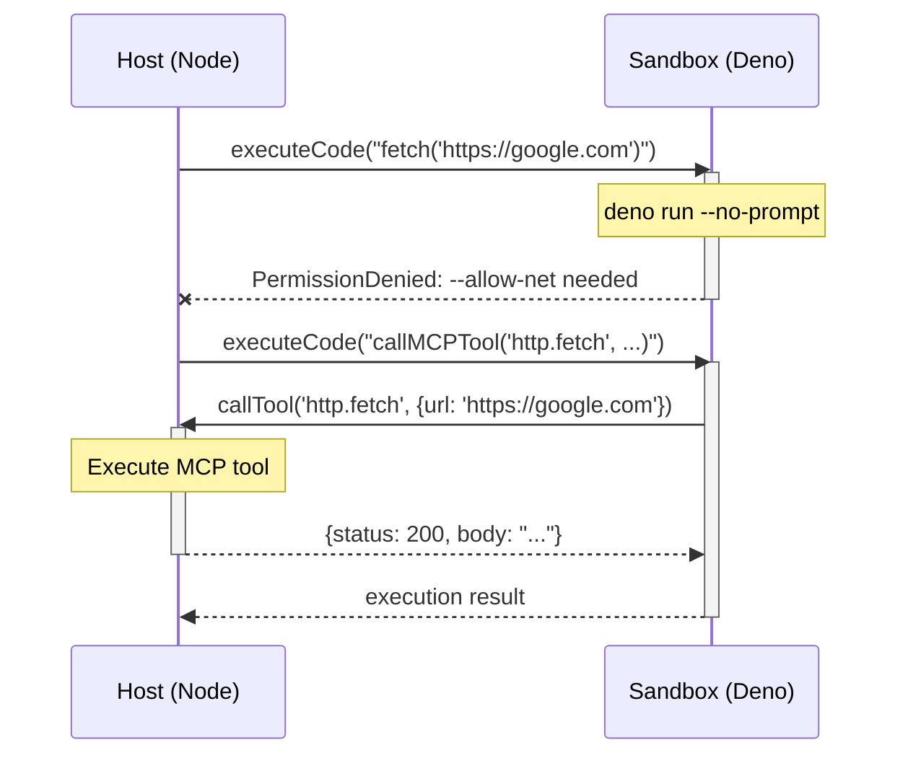

# @mcpc/handle-sandbox

[](https://jsr.io/@mcpc/handle-sandbox)

Simple and secure JavaScript code execution using Deno sandbox. Run user code in
isolation with custom function injection.

## Features

- 🔒 **Secure Sandboxing**: Uses Deno's permission system for isolated code
  execution
- 🔌 **JSON-RPC IPC**: Handler calls transmitted via JSON-RPC between sandbox
  and host
- 🎯 **Custom Functions**: Inject any async functions into sandbox via
  `registerHandler()`
- 📦 **Zero Config**: Automatically locates Deno binary from npm package
- 🛡️ **Resource Limits**: Configurable timeouts and memory limits

## Installation

```bash
# npm
npm install @mcpc-tech/handle-sandbox

# jsr
npx jsr add @mcpc/handle-sandbox
deno add @mcpc/handle-sandbox --allow-scripts=npm:deno
```

## Quick Start

### Basic Usage

```typescript
import { Sandbox } from "@mcpc/handle-sandbox";

const sandbox = new Sandbox();
sandbox.start();

const result = await sandbox.execute(`
  console.log("Hello from sandbox!");
  return 1 + 1;
`);

console.log(result.logs); // ["Hello from sandbox!"]
console.log(result.result); // 2

sandbox.stop();
```

### With Custom Functions

```typescript
import { Sandbox } from "@mcpc/handle-sandbox";

const sandbox = new Sandbox();

// Register custom functions
sandbox.registerHandler("fetchUser", async (userId) => {
  return { id: userId, name: "Alice" };
});

sandbox.registerHandler("saveData", async (data) => {
  // Save to database
  return { success: true };
});

sandbox.start();

// Use custom functions in code
const result = await sandbox.execute(`
  const user = await callHandler("fetchUser", 123);
  console.log("User:", user.name);
  
  await callHandler("saveData", { userId: user.id, action: "login" });
  return user;
`);

sandbox.stop();
```

### With Timeout and Memory Limits

```typescript
import { Sandbox } from "@mcpc/handle-sandbox";

const sandbox = new Sandbox({
  timeout: 5000, // 5 seconds
  memoryLimit: 256, // 256 MB
  permissions: ["--allow-net=api.example.com"],
});

sandbox.start();

const result = await sandbox.execute(`
  return "code runs here";
`);

sandbox.stop();
```

## How It Works

The sandbox uses bidirectional JSON-RPC communication:

1. Host spawns Deno sandbox subprocess
2. Host sends `executeCode` request with user's JavaScript code
3. Sandbox runs the code
4. When code calls `callHandler(name, ...args)`:
   - Sandbox sends `callHandler` request to host
   - Host executes the registered handler function
   - Host sends response back to sandbox
   - Sandbox receives result and continues code execution
5. Sandbox returns final execution result to host

## API

### `new Sandbox(config?)`

Create a new sandbox instance.

**Config Options:**

- `timeout?: number` - Execution timeout in milliseconds (default: 30000)
- `memoryLimit?: number` - Memory limit in MB
- `permissions?: string[]` - Deno permission flags

### `sandbox.registerHandler(name, handler)`

Register a function that can be called from sandbox code.

```typescript
sandbox.registerHandler("myFunction", async (arg1, arg2) => {
  return result;
});
```

### `sandbox.start()`

Start the Deno subprocess. Call this before executing code.

### `sandbox.execute(code, context?)`

Execute JavaScript code in the sandbox.

**Returns:** `Promise<{ logs: string[], result?: any, error?: string }>`

**Parameters:**

- `code: string` - JavaScript code to execute
- `context?: Record<string, any>` - Additional context (optional)

### `sandbox.stop()`

Stop the sandbox and clean up resources.

## Security Model

The Deno sandbox runs with minimal permissions by default. You control access by
passing Deno permission flags directly:

```typescript
// No permissions - can only call registered handlers
new Sandbox();

// Allow network access to specific domains
new Sandbox({
  permissions: ["--allow-net=github.com,api.example.com"],
});

// Allow reading specific directories
new Sandbox({
  permissions: ["--allow-read=/tmp,/var/log"],
});
```

**Permission Model**

```typescript
// Sandbox runs WITHOUT permissions by default
// ❌ These operations will fail:
const code = `
  await Deno.readTextFile('/file.txt');        // PermissionDenied: --allow-read needed
  await fetch('https://api.com');               // PermissionDenied: --allow-net needed
  Deno.env.get('SECRET');                       // PermissionDenied: --allow-env needed
`;

// ✅ Operations must use registered handlers:
sandbox.registerHandler("readFile", async (path) => {
  return await fs.readFile(path, "utf-8");
});

const code = `
  const content = await callHandler("readFile", "/file.txt");
`;
```

## Architecture

## Architecture



## How It Works (Detailed)

1. Your app spawns Deno subprocess
2. Sends code to execute via JSON-RPC
3. Sandbox runs code in isolated environment
4. When code calls registered handlers, sandbox sends request back
5. Your app handles request and sends response
6. Sandbox receives response and continues execution

## Examples

See `examples/` directory for complete examples:

- `basic-usage.ts` - Simple code execution

## Development

```bash
# Run tests
deno test --allow-all tests/

# Run example  
deno run --allow-all examples/basic-usage.ts
```

## License

MIT
